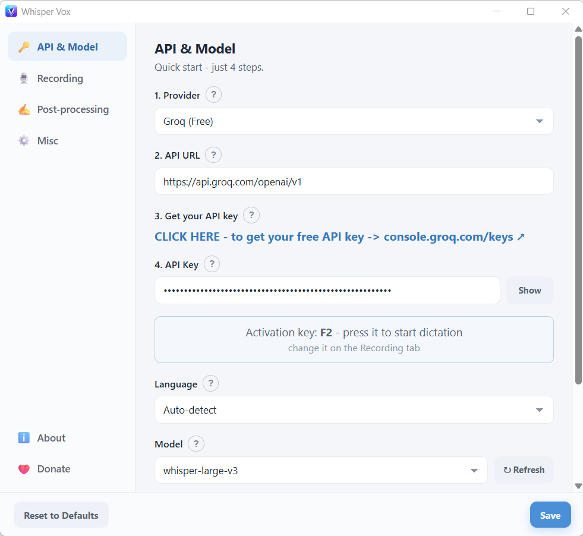
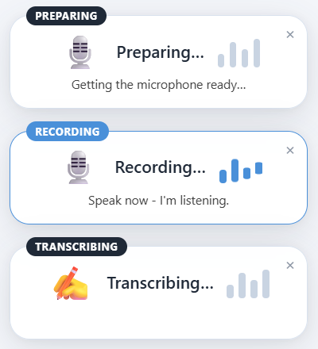

# Whisper Vox

**AI-powered voice-to-text dictation.**

Hold a key. Speak. Release. Your words appear — in any app.

No account to create, no telemetry, no background uploads. Your speech is sent
only to the transcription service you choose, and only while you are dictating.

---

## What it does

- **Hold-to-dictate** — press and hold the hotkey (default: **F2**), speak, release. Done.
- **Types anywhere** — browsers, email clients, chat apps, Office, Notion, coding tools, AI assistants — any app that accepts keyboard input.
- **99 languages, auto-detected** — speak in English, Spanish, Ukrainian, Japanese, Arabic, or any of the ~99 languages supported by Whisper. Switch languages mid-session without changing any settings.
- **Live status window** — shows when the mic is warming up and when it's recording, so you always know when to speak.
- **Microphone selector** — pick any audio device, rescan without restarting.
- **Custom hotkey** — any key or combination.
- **Runs from the tray** — lightweight background process, appears only when you need it.

  

  

## Where people use it

| Workflow | Examples |
| --- | --- |
| Email & messaging | Gmail, Outlook, Slack, Teams, Telegram |
| AI assistants | ChatGPT, Claude, Gemini, Copilot, any web AI |
| Documents | Word, Google Docs, Notion, Obsidian |
| Code & terminals | VS Code comments, commit messages, README drafts |
| Forms & CRM | HubSpot, Salesforce, any browser form |
| Social & content | Twitter/X, LinkedIn, YouTube comments |

## Privacy

- Your audio is sent **only** to the transcription service you configure, and
  **only** during a dictation. Nothing is kept or uploaded otherwise.
- The app does not collect analytics or identifiers.
- Your dictated text is never written to any log.

## Install

1. Download the latest installer from the
   [Releases page](https://github.com/whisper-vox/whisper-vox/releases).
2. Run it — Whisper Vox installs for your user account (no admin rights needed)
   and starts in the system tray.
3. Open the window, choose a service, and paste your API key. A free key is
   available from Groq at <https://console.groq.com/keys>.

Then just press your activation key (**F2** by default) and speak.

## Uninstall

Windows **Settings → Apps → Whisper Vox → Uninstall**.

## License

Whisper Vox is free software, licensed under the
**GNU General Public License v3.0** — see [LICENSE](LICENSE).

Copyright (C) 2026 Pekelni Boroshna Lab.

This program is distributed in the hope that it will be useful, but WITHOUT ANY
WARRANTY; without even the implied warranty of MERCHANTABILITY or FITNESS FOR A
PARTICULAR PURPOSE. See the GNU General Public License for more details.
