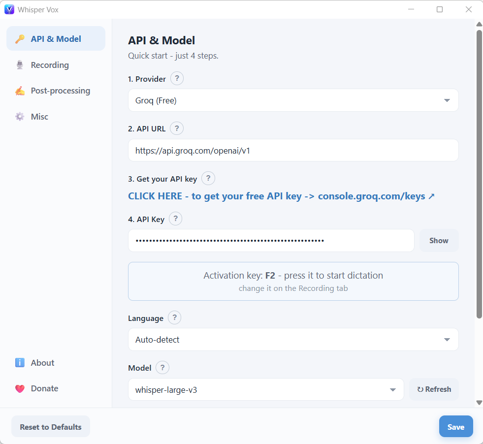
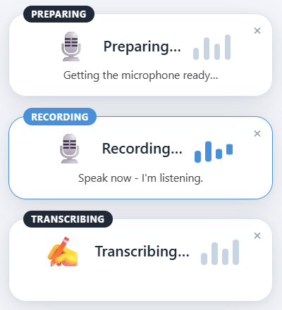

# Whisper Vox

**AI-powered voice-to-text dictation.**

Hold a key. Speak. Release. Your words appear - in any app.

No account to create, no telemetry, no background uploads. Your speech is sent
only to the transcription service you choose, and only while you are dictating.

---

## What it does

- **Windows and macOS** - the same app on both, with each one's own conventions.
- **Hold-to-dictate** - press and hold the hotkey (**F2** on Windows, **Ctrl+Escape** on macOS), speak, release. Done.
- **Types anywhere** - browsers, email clients, chat apps, Office, Notion, coding tools, AI assistants - any app that accepts keyboard input.
- **99 languages, auto-detected** - speak in English, Spanish, Ukrainian, Japanese, Arabic, or any of the ~99 languages supported by Whisper. Switch languages mid-session without changing any settings.
- **Live status window** - shows when the mic is warming up and when it's recording, so you always know when to speak.
- **Microphone selector** - pick any audio device, rescan without restarting.
- **Custom hotkey** - any key or combination.
- **Runs from the tray** - or the macOS menu bar. A lightweight background process that appears only when you need it.

  

  

## Where people use it

| Workflow | Examples |
| --- | --- |
| Email & messaging | Gmail, Outlook, Slack, Teams, Telegram |
| AI assistants | ChatGPT, Claude, Gemini, Copilot, any web AI |
| Documents | Word, Google Docs, Notion, Obsidian |
| Code & terminals | VS Code comments, commit messages, README drafts |
| Forms & CRM | HubSpot, Salesforce, any browser form |
| Social & content | Twitter/X, LinkedIn, YouTube comments |

## Privacy

- Your audio is sent **only** to the transcription service you configure, and
  **only** during a dictation. Nothing is kept or uploaded otherwise.
- The app does not collect analytics or identifiers.
- Your dictated text is never written to any log.

## Install

Everything is on the
[Releases page](https://github.com/whisper-vox/whisper-vox/releases).

### Windows

1. Download the `.zip`, extract it, and run `WhisperVox-Setup.exe`. It installs
   for your user account (no admin rights needed) and starts in the system tray.
2. Open the window, choose a service, and paste your API key. A free key is
   available from Groq at <https://console.groq.com/keys>.

Then press **F2** and speak.

### macOS

1. Download the `.dmg` - one file for every Mac, Intel and Apple Silicon alike -
   and drag **WhisperVox.app** to Applications. Open it **from Applications**,
   not from the disk image: macOS will not remember permissions for an app
   running off a mounted image.
   On Apple Silicon the first launch offers to install Rosetta; that is one
   click and about a minute.
2. This build is not signed by Apple, so the first launch is blocked. Open
   **System Settings → Privacy & Security**, scroll down, and click
   **Open Anyway** next to the Whisper Vox message.
3. Whisper Vox sits in the **menu bar** and keeps a Dock icon, so you can reach
   it either way. Open Settings and paste your API key.
4. macOS gates two of the things the app does, and Settings → Misc lists them
   with a button for each: **Microphone** to hear you, and **Accessibility** to
   type the text into other apps.

Then hold **Ctrl+Escape** and speak. To use a different combination, change it
on the Recording tab - the **Test** button next to it tells you whether the one
you picked is free, which macOS itself will not.

Until the app is signed with an Apple Developer ID, macOS forgets both
permissions after every update and you have to switch them on again.

## Uninstall

- **Windows** - **Settings → Apps → Whisper Vox → Uninstall**.
- **macOS** - drag the app to the Bin. Its settings live in
  `~/Library/Application Support/WhisperVox`, and autostart, if you turned it
  on, in `~/Library/LaunchAgents/com.pekelniboroshna.whispervox.plist`.

## License

Whisper Vox is free software, licensed under the
**GNU General Public License v3.0** - see [LICENSE](LICENSE).

Copyright (C) 2026 Pekelni Boroshna Lab.

This program is distributed in the hope that it will be useful, but WITHOUT ANY
WARRANTY; without even the implied warranty of MERCHANTABILITY or FITNESS FOR A
PARTICULAR PURPOSE. See the GNU General Public License for more details.
